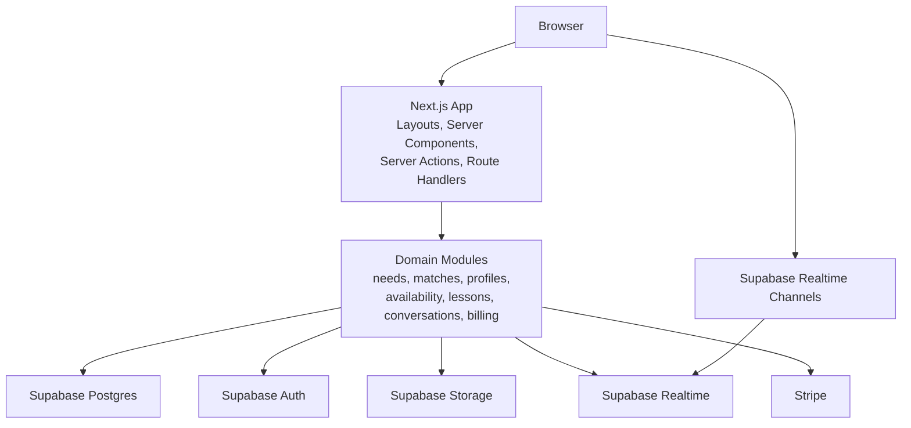

# Mentor IB Architecture Discussion v1

**Date:** 2026-04-07
**Status:** Standalone architecture recommendation for the approved design pack
**Scope:** application shape, domain structure, data boundaries, integrations, and phased technical decisions

## 1. Why This Document Exists

This document translates the approved Mentor IB UX system into a concrete architecture recommendation.

It is intentionally written to be:

- standalone
- self-contained
- tied to the approved product model

This is not yet a build log.

It is the architecture baseline the implementation should react to before build work starts.

## 2. Embedded Product Constraints

The approved UX work establishes several non-negotiables that architecture must serve.

### 2.1 One ecosystem, not two products

Mentor IB is one product with two operating modes:

- student guidance mode
- tutor operating mode

Architecture should preserve that unity.

It should not create:

- a polished student storefront plus a separate tutor back office
- separate codebases for student and tutor unless that becomes unavoidable later
- separate component systems for role-specific views

### 2.2 Shared canonical objects

The UX system is built around shared objects, not isolated pages.

The most important shared objects are:

- `Account`
- `Person`
- `Student`
- `Tutor`
- `LearningNeed`
- `Match`
- `TutorProfile`
- `Availability`
- `Lesson`
- `Conversation`
- `Review`
- `Report`
- `Earning`
- `Notification`

Architecture should map cleanly to those objects.

### 2.3 Matching-first product

This is not a generic tutor marketplace.

The core loop is:

1. student defines a real IB need
2. system ranks tutor fit against that need
3. student evaluates and books
4. tutor manages lessons and schedule
5. both roles stay connected through lessons and conversations

That means matching, lesson continuity, and schedule integrity are core platform concerns.

### 2.4 Approved MVP route shape

The approved phase 1 MVP route set is:

- `/`
- `/match`
- `/results`
- `/tutors/:slug`
- `/book/:tutorOrLessonContext`
- `/messages`
- `/lessons`
- `/tutor/overview`
- `/tutor/lessons`
- `/tutor/schedule`
- `/tutor/messages`

Phase 1.5 adds:

- `/compare`
- `/tutor/students`

Phase 2 adds:

- `/tutor/apply`
- deeper tutor profile management
- reporting and broader operations

Architecture should make phase 1 simple without forcing a rewrite for phase 2.

## 3. Architecture Goals

The recommended architecture should optimize for:

- one coherent product shell across student and tutor flows
- fast MVP delivery without premature platform complexity
- strong authorization and data boundaries
- first-class shared objects and shared components
- good support for server rendering and responsive UI
- manageable operational burden for a small team
- clear growth path for realtime, search, and payouts

## 4. Non-Goals For The First Architecture Cut

The first architecture cut should explicitly avoid:

- microservices
- separate student and tutor apps
- a generic internal REST API layer for everything
- premature search infrastructure like Algolia or Elasticsearch
- premature event-driven platform complexity
- custom payout onboarding UI

## 5. Options Considered

## 5.1 Option A: Modular monolith with Next.js, Supabase, and Stripe

### Summary

One repo, one web application, one shared domain model.

Use:

- `Next.js App Router` for the product shell and route composition
- `Supabase` for Postgres, Auth, Storage, and Realtime
- `Drizzle ORM` for typed server-side database access
- `Stripe` for payments, then phased marketplace payouts

### Fit with approved UX

This option aligns best with:

- one product / two modes
- server-rendered content plus interactive islands
- shared objects across roles
- relatively fast iteration
- lower team and operational overhead

### Tradeoffs

- the app becomes the center of many responsibilities
- good module boundaries matter a lot
- database and auth design must stay disciplined from the start

## 5.2 Option B: Split frontend and separate backend API service

### Summary

Separate the web frontend from a custom backend service from day one.

### Why it is not recommended now

- it adds more deployment, auth, and data-shaping complexity before the product is proven
- it introduces an internal API layer before there is a second client that truly needs it
- it slows iteration on the shared student-tutor object model

### When it could make sense later

- native apps become first-class
- many third-party integrations require a broader integration layer
- background jobs and domain logic outgrow the web app runtime

## 5.3 Option C: Separate student app and tutor app

### Summary

Build two distinct applications with separate route trees, layouts, and likely duplicated UI layers.

### Why it should be rejected

This directly conflicts with the approved UX system.

It would encourage:

- duplicated lesson and conversation UIs
- duplicated person and schedule representations
- role drift in state language and interaction patterns
- a psychologically fragmented product experience

## 6. Recommendation Summary

The recommended baseline architecture is:

- one repo
- one Next.js application
- one top-level product shell
- one shared domain model
- server-first rendering and data access
- Supabase as the managed backend platform
- Stripe as the billing platform
- modular monolith boundaries inside the codebase

Short version:

**Build one product, not a network of services pretending to be one product.**

## 7. Recommended Stack

## 7.1 Web application

- `Next.js App Router`
- `React`
- TypeScript

### Why

This fits the product because it supports:

- a single root application shell
- server-rendered public and authenticated routes
- nested layouts for public, student, and tutor sections
- selective client-side interactivity where it is actually needed

## 7.2 Hosting

- `Vercel` for the Next.js application

### Why

- it is the natural deployment path for a Next.js App Router app
- preview environments are useful for design-heavy UI validation
- it keeps the first deployment model simple

A dedicated companion now exists for runtime and performance behavior:

- `performance-and-runtime-architecture-v1.md`

## 7.3 Data platform

- `Supabase Postgres`
- `Supabase Auth`
- `Supabase Storage`
- `Supabase Realtime`

### Why

This covers the main platform needs with one managed backend:

- relational data with Postgres
- role-aware auth
- file uploads
- realtime updates for chat and operational surfaces

### Important clarification

Supabase should remain both the data platform and the auth platform for the MVP.

That is now the preferred direction because it keeps the stack smaller and avoids introducing a second auth system.

The practical tradeoff is:

- during development, accept the default Supabase-hosted auth domain and less polished Google consent presentation
- for the branded MVP launch, move to the paid custom-domain setup when the team is ready for that monthly cost

## 7.4 Auth platform

### Supported product requirement

The auth system must support:

- magic link sign-in
- Google login
- one shared post-auth flow

For both methods the logic should be the same:

- if the person already has an account, sign them in
- if the person is new, create the account
- then route them into role choice if they have not chosen between learning and teaching yet

### MVP recommendation

Use:

- `Supabase Auth`
- Google login
- magic link email sign-in
- one shared post-auth resolver in the application layer

### Why this is the recommended MVP path

- it keeps auth, database, storage, and optional realtime in one platform
- it minimizes tools and integration surfaces
- it keeps Google login and magic link behavior unified
- it makes secure Supabase Realtime available if the MVP needs it

### Development versus MVP branding

During development, it is reasonable to tolerate the default Supabase auth domain and the less branded Google login surface.

For the public MVP launch, plan for:

- paid custom domain
- branded auth callbacks
- cleaner trust presentation in OAuth flows

## 7.5 Server-side data access

- `Drizzle ORM` on the server

### Why

Drizzle is a strong fit here because the product model is relational, domain-heavy, and likely to need SQL-shaped queries rather than generic CRUD scaffolding.

It also works well with a modular monolith approach because it stays relatively close to SQL and does not force the entire project into a framework-shaped data layer.

### Important rule

The app should not rely on browser-side direct database access for core domain operations.

The main path should be:

- browser requests page or action
- Next server layer verifies access
- domain module executes data logic
- DTO-safe data is returned to the UI

## 7.6 Payments

- `Stripe Checkout` first
- request-time payment authorization with acceptance-time capture
- `Stripe Connect Express` when tutor payout readiness enters live scope

### Why

This keeps student payment capture simple in the first build while avoiding custom payment UI and still supports the Mentor IB booking rule:

- student places the booking request and payment hold once
- tutor accepts or declines inside a short response window
- acceptance captures the payment
- decline or timeout releases the authorization

The architecture should still reserve clean module boundaries for:

- billing
- payouts
- tutor payout state

## 8. High-Level Topology



## 9. Frontend Application Shape

## 9.1 Routing strategy

Use one top-level root layout for the whole product.

Then use route groups and nested layouts to organize sections without splitting the product into multiple root applications.

### Recommended route organization

```text
src/app/
  layout.tsx
  (public)/
    page.tsx
    match/page.tsx
    results/page.tsx
    tutors/[slug]/page.tsx
  (student)/
    book/[context]/page.tsx
    messages/page.tsx
    lessons/page.tsx
    compare/page.tsx
  tutor/
    layout.tsx
    overview/page.tsx
    lessons/page.tsx
    schedule/page.tsx
    messages/page.tsx
    students/page.tsx
    apply/page.tsx
```

### Rule

Use nested layouts for mode-specific chrome.

Do not use multiple disconnected root layouts unless the product experience truly becomes separate enough to justify full page reload boundaries between sections.

## 9.2 UI system implementation

The approved design system should map into code as a shared stack:

### Layer 1: tokens

- CSS variables
- typography
- color
- spacing
- radius
- shadow
- motion
- breakpoint tokens

### Layer 2: primitives

- `Button`
- `TextField`
- `Select`
- `Badge`
- `Panel`
- `Avatar`
- `TabBar`

### Layer 3: shared continuity anchors

- `NeedSummaryBar`
- `LessonSummary`
- `PersonSummary`
- `ContextChipRow`

### Layer 4: shared composites

- `MatchRow`
- `TrustProofBlock`
- `LessonCard`
- `LessonDetail`
- `ScheduleSurface`
- `ConversationShell`
- `CompareTable`

### Rule

Do not create:

- `student-components/*`
- `tutor-components/*`

for objects that are fundamentally shared.

Role differences should usually be handled by:

- props
- slots
- density
- permission gates
- contextual actions

not by duplicating the component.

## 9.3 Rendering model

Prefer a server-first rendering model.

### Default

- Server Components for page composition and data-heavy views
- Server Actions for authenticated mutations initiated by forms and UI controls
- Route Handlers for webhooks and external callbacks

### Client Components only where needed

- message composer and live thread behavior
- rich schedule interaction
- advanced filtering controls
- optimistic local interactions

### Benefit

This reduces duplication between UI routes and internal APIs while keeping the majority of data access close to the server-side authorization layer.

## 10. Domain Module Structure

Use feature-oriented domain modules instead of page-owned data code.

### Recommended module set

- `accounts`
- `people`
- `students`
- `tutors`
- `learning-needs`
- `matches`
- `availability`
- `lessons`
- `conversations`
- `reviews`
- `reports`
- `notifications`
- `billing`
- `files`

### Recommended internal shape per module

```text
src/modules/lessons/
  schema.ts
  types.ts
  repository.ts
  service.ts
  policies.ts
  dto.ts
  formatters.ts
```

### Ownership rule

Routes should compose modules.

Routes should not become the place where business rules live.

## 11. Data Model And Schema Strategy

## 11.1 Core recommendation

Use Postgres as the single source of truth for domain state.

The core domain should stay relational.

This product is centered on structured objects:

- needs
- matches
- availability
- lessons
- conversations
- reviews
- earnings

That strongly favors Postgres over a document-style primary store.

## 11.2 Recommended schema boundary

Use a custom application schema for most domain tables rather than treating the default `public` schema as the app's unrestricted storage bucket.

### Suggested split

- `auth`
  - Supabase-managed auth tables
- `app`
  - core product tables
- `public` or `api`
  - only client-safe views, RPC functions, or deliberately exposed tables if needed

### Why

This supports a safer boundary between:

- server-owned domain access
- explicitly exposed client-facing access paths

## 11.3 Proposed canonical table families

The exact naming can change, but the model should cover:

- `auth.users`
- `auth.identities`
- `app_users`
- `user_roles`
- `student_profiles`
- `tutor_profiles`
- `tutor_credentials`
- `learning_needs`
- `match_results`
- `availability_rules`
- `availability_overrides`
- `lessons`
- `lesson_status_history`
- `conversations`
- `conversation_participants`
- `messages`
- `reviews`
- `lesson_reports`
- `notifications`
- `payments`
- `payout_accounts`
- `payouts`

## 11.4 Match representation rule

Do not represent matching as a generic search result cache only.

The system should preserve:

- the originating `LearningNeed`
- the fit explanation
- the current tutor availability signal
- the shortlist and booking trail

That makes `Match` a first-class domain object, even if some ranking is computed on demand.

## 12. Auth And Authorization Model

## 12.1 Auth provider strategy

The architecture should intentionally use `Supabase Auth` as the single auth provider for the first product version.

### MVP recommendation

For both development and MVP, use `Supabase Auth` with:

- Google login
- magic link email sign-in
- one shared callback and onboarding resolver

### Why

This is the cleanest way to satisfy the product requirement while keeping the stack minimal:

- one platform handles auth, database, storage, and optional realtime
- Google and magic-link flows can share the same onboarding logic
- it reduces architectural sprawl

### Branding tradeoff

The cost tradeoff should be handled by phase:

- development:
  - use the default Supabase auth domain
- branded MVP:
  - enable the paid custom-domain setup

That keeps the architecture stable while letting the brand polish catch up when launch quality matters.

## 12.2 Identity model

Use one account system.

Each authenticated user should map to one canonical application user record, with role capability layered on top.

### Recommended shape

- `auth.users`
- `app_users`
- optional student profile
- optional tutor profile
- role and status fields

This keeps open the possibility that one person can operate in more than one mode later without creating a separate login universe.

### Identity mapping rule

The system should use the Supabase auth user plus verified email to resolve one canonical product account.

For both Google login and magic link:

1. verify the user through Supabase Auth
2. resolve the verified email
3. look up an existing `app_user`
4. if one exists, sign in and continue
5. if one does not exist, create `app_user` with an onboarding state like `role_pending`
6. redirect the user to choose whether they are learning or teaching

Supabase Auth supports linked identities and automatic linking for matching verified emails.

That means Google login and magic-link sign-in can still converge on one user account when the verified email matches, which supports the desired product logic without introducing a second auth system.

## 12.3 Access control rule

Use a dual-layer model:

- application-layer authorization in the Next server domain layer
- database-layer protection with Row Level Security wherever client or realtime access can touch data

### Why

The application layer keeps business rules readable.

The database layer prevents accidental exposure when using client-authenticated access paths.

## 12.4 Protection model

### Optimistic checks

Use lightweight session-based checks in route protection and shell composition when the goal is:

- redirecting an unauthenticated user
- hiding role-incompatible entry points

### Secure checks

Use verified identity plus domain authorization inside the data access layer before returning sensitive data or mutating domain state.

### Rule

UI checks alone are never enough.

## 13. Data Access Strategy

## 13.1 Recommended rule

Use the Next server layer as the main backend-for-frontend.

Do not create an internal REST or GraphQL API for routine in-app page data unless another client actually needs it.

### Main path

- Server Components read via domain services
- Server Actions mutate via domain services
- Route Handlers are reserved for:
  - Stripe webhooks
  - auth callbacks
  - file callback flows
  - limited public endpoints

## 13.2 DTO rule

Routes and components should receive DTO-safe data, not raw database records.

That matters especially for:

- tutor public profile shaping
- lesson visibility by role
- conversation metadata
- billing and payout data

## 13.3 Database migration rule

Even if Drizzle is used for typed access, database change discipline must remain explicit.

The architecture should support SQL-first changes for:

- RLS policies
- functions
- triggers
- publications
- custom schemas

This product will almost certainly need all of those.

## 14. Realtime And Messaging

Messaging now has a dedicated architecture companion:

- `message-architecture-v1.md`

That document should be treated as the more detailed authority for message scope, security, realtime usage, and external-tool tradeoffs.

## 14.1 Core rule

The canonical source of truth for conversations and messages should stay in Postgres.

Realtime is the delivery layer, not the primary data model.

## 14.2 MVP recommendation

For MVP, use:

- persisted `conversations` and `messages` rows in Postgres
- Supabase Realtime subscriptions for new-message and status-update delivery
- server-first message writes and canonical thread reads

### Practical approach

Start simple and keep the seam clear:

- domain service persists the message
- realtime channel delivers the new event
- UI rehydrates from canonical conversation data

## 14.3 Scaling path

If messaging volume grows, keep the architecture ready to move from simpler channel usage toward stronger Realtime patterns while preserving Postgres as canonical storage.

That gives a clean path from:

- simpler MVP message delivery and targeted status updates

to:

- broader Supabase Realtime usage
- or another dedicated realtime transport if the scale profile later requires it

without changing the actual conversation model.

## 14.4 Presence

Presence should be additive, not foundational.

Good uses later:

- "online now"
- "viewing lesson details"
- "typing"

It should not become required for the product to function.

## 15. Scheduling And Availability

## 15.1 Recommendation

Scheduling should be a native product module, not outsourced as a primary system to a third-party booking product.

### Why

The approved UX already treats `Availability` and `Lesson` as shared first-class objects.

The system needs:

- recurring weekly availability
- overrides and blackout periods
- timezone-aware slot generation
- lesson-linked booking context
- reschedule integrity
- student and tutor views of the same schedule grammar

That is product logic, not just calendar embedding.

## 15.2 Suggested availability model

Store:

- recurring weekly rules
- date-specific overrides
- notice windows
- buffers
- capacity rules
- timezone

Then generate bookable slots server-side from those rules.

## 15.3 Lesson snapshot rule

When a lesson is booked, store a stable booking snapshot so later schedule edits do not retroactively corrupt lesson history.

## 15.4 External calendar policy

External calendar sync can be added later, but it should not replace the product's own availability model.

A dedicated companion now exists for meeting access and calendar behavior:

- `meeting-and-calendar-architecture-v1.md`

## 16. Search And Matching

## 16.1 Recommendation

Do not start with a third-party search product.

Start with Postgres-backed matching and ranking logic.

### Why

The product's differentiation is not "fast text search over tutors."

It is:

- fit against an IB-specific need
- reasoning visibility
- schedule overlap
- proof and trust ranking

That is domain-specific ranking logic best kept close to the application and the relational source data at first.

## 16.2 Suggested first implementation

Use:

- normalized tutor profile data
- need attributes
- availability overlap
- scoring functions or weighted rules
- explanation generation for the visible fit rationale

## 16.3 Scaling path

If tutor volume or query complexity grows later:

- add a denormalized read model
- add materialized views
- add a specialized search index only when the actual need is proven

A dedicated companion now exists for this area:

- `matching-and-ranking-architecture-v1.md`

## 17. Billing And Tutor Payouts

## 17.1 Recommended phase split

### Phase 1

- booking-linked payment authorization at request submission
- capture on tutor acceptance
- authorization release on decline or request expiry
- refund handling tied to cancellation and no-show policy
- dispute-aware lesson issue handling for no-show, wrong-link, and major technical-failure cases
- payment status in lesson flow
- minimal tutor payout-readiness support for live payout operations

### Phase 2

- richer finance dashboard
- payout reconciliation tooling
- multi-currency or tax-surface expansion if ever needed

## 17.2 Why this split is recommended

The product can validate the core value loop before taking on the full operational weight of marketplace payouts.

That said, the billing domain should be designed from the start with clean boundaries for:

- charges
- refunds
- payout account status
- payouts
- ledger-like reporting
- lesson issue outcomes that drive refund, payout, and reliability decisions

## 17.3 Stripe integration rule

Use Stripe-hosted flows where possible in the first cut.

That applies especially to:

- Checkout for booking-time payment authorization
- capture on tutor acceptance while the authorization is still valid
- hosted onboarding for connected tutor accounts

The capture model only works safely if the tutor-decision window stays well inside Stripe's authorization validity window.

Avoid custom payout onboarding UI unless the product has a very specific reason to own that complexity.

## 18. File Uploads And Media

Use Supabase Storage for:

- tutor profile media
- credential uploads
- report attachments if needed later

Rule:

- uploads should resolve into domain-owned metadata records
- storage objects alone are not enough as product state

A dedicated companion now exists for this area:

- `file-and-media-architecture-v1.md`

## 19. Notifications And Background Work

## 19.1 Notification model

Treat notifications as a domain module, not just UI sugar.

The system should support:

- in-app notifications
- email notifications
- future reminder automation

## 19.2 Background work policy

Do not start with a separate worker platform unless the product immediately requires it.

Instead:

- keep side effects explicit
- use webhooks for external system events
- create a clear `jobs` or `notifications` boundary so reminders, digests, or payout reconciliation can move to background execution later

A dedicated companion now exists for this area:

- `background-jobs-and-notifications-architecture-v1.md`

## 20. Recommended Repository Shape

```text
src/
  app/
  components/
    ui/
    shared/
  modules/
    accounts/
    people/
    students/
    tutors/
    learning-needs/
    matches/
    availability/
    lessons/
    conversations/
    reviews/
    reports/
    notifications/
    billing/
  lib/
    auth/
    db/
    realtime/
    payments/
    storage/
  styles/
    tokens.css
```

### Rule

Prefer feature ownership for business logic and shared UI ownership for primitives.

Do not let route folders become the dumping ground for domain logic.

## 21. Decisions To Lock Now

These decisions are mature enough to lock now:

- one app, not separate student and tutor apps
- modular monolith, not microservices
- Next.js App Router as the frontend application architecture
- Supabase as the backend platform
- Supabase Auth as the auth provider
- Postgres as the canonical source of truth
- server-first data access
- native scheduling model
- Postgres-backed matching first
- Stripe for billing

## 22. Decisions To Defer Slightly

These should stay open for a short follow-up pass, but not block the overall direction:

- exact ORM and migration discipline details
- exact message delivery approach for MVP versus higher scale
- whether phase 1 includes live tutor payouts or only payment capture
- exact email provider
- exact background job tool, if any

## 23. Primary Risks And Mitigations

## 23.1 Risk: UI architecture drifts into two worlds

### Mitigation

- one root app
- one shared component library
- one shared domain object model
- nested layouts instead of separate apps

## 23.2 Risk: direct client database access leaks too much data

### Mitigation

- keep core data access server-first
- use DTO shaping
- apply RLS to any client-touched data path
- keep exposed database surface minimal

## 23.3 Risk: scheduling becomes fragile

### Mitigation

- own the availability model
- compute slots server-side
- store lesson booking snapshots

## 23.4 Risk: chat or notifications hit scale limits

### Mitigation

- keep Postgres canonical
- isolate the messaging delivery adapter
- preserve a path from simple Realtime usage to more advanced delivery patterns later

## 23.5 Risk: billing complexity arrives too early

### Mitigation

- phase payments and payouts separately
- design billing boundaries early
- delay marketplace payout automation until it is actually in scope

## 24. Recommended Next Architecture Actions

The next architecture-phase deliverables should be:

1. confirm the exact phase 1 scope versus phase 1.5
2. define the module map in more detail
3. define the database schema outline
4. define the auth and authorization matrix
5. define the route and layout file structure
6. define SEO and discoverability rules for public pages
7. then pick the exact implementation stack details and start scaffolding

## 25. Final Recommendation

Mentor IB should start as a **shared-object modular monolith**:

- one Next.js application
- one cohesive UX shell
- one relational domain core
- one managed backend platform in Supabase for data and auth
- one billing integration in Stripe

This is the architecture that best matches the approved product strategy.

It preserves the matching-first UX, keeps student and tutor modes in one ecosystem, and gives the team the fastest credible path into implementation without architecting a much larger company than the product currently needs.

## 26. Official Source Notes

The recommendation above is informed by current official documentation for:

- Next.js App Router, authentication guidance, layouts, and route groups
- Supabase custom domains, auth verification, identity linking, RLS, API hardening, Realtime, and Postgres Changes/Broadcast
- Stripe Checkout and Connect onboarding
- Drizzle ORM overview

A dedicated set of companion architecture and data docs now exists:

- `accessibility-and-inclusive-ux-architecture-v1.md`
- `analytics-and-product-telemetry-architecture-v1.md`
- `background-jobs-and-notifications-architecture-v1.md`
- `compliance-and-regulatory-posture-v1.md`
- `configuration-and-governance-architecture-v1.md`
- `file-and-media-architecture-v1.md`
- `matching-and-ranking-architecture-v1.md`
- `meeting-and-calendar-architecture-v1.md`
- `observability-and-incident-architecture-v1.md`
- `performance-and-runtime-architecture-v1.md`
- `query-performance-slos-and-scaling-thresholds-v1.md`
- `rating-and-review-trust-architecture-v1.md`
- `security-architecture-v1.md`
- `privacy-and-data-retention-architecture-v1.md`
- `admin-and-moderation-architecture-v1.md`
- `seo-and-ai-discoverability-v1.md`
- `seo-app-architecture-v1.md`
- `search-and-query-architecture-v1.md`
- `search-platform-decision-v1.md`
- `search-console-and-observability-architecture-v1.md`
- `seo-page-inventory-v1.md`
- `metadata-matrix-v1.md`
- `structured-data-map-v1.md`
- `testing-and-release-architecture-v1.md`
- `content-template-spec-v1.md`
- `docs/architecture/route-layout-implementation-map-v1.md`
- `docs/data/database-schema-outline-v1.md`
- `docs/data/auth-and-authorization-matrix-v1.md`
- `docs/data/database-rls-boundaries-v1.md`
- `docs/data/projection-maintenance-strategy-v1.md`
- `docs/data/migration-conventions-v1.md`
- `docs/data/projection-sql-patterns-v1.md`
- `docs/data/supabase-folder-and-file-conventions-v1.md`
- `docs/data/seed-and-fixture-data-strategy-v1.md`
- `docs/data/drizzle-schema-and-query-conventions-v1.md`
- `docs/data/database-test-conventions-v1.md`
- `docs/data/reference-data-governance-v1.md`
- `docs/data/integration-idempotency-model-v1.md`
- `docs/data/database-change-review-checklist-v1.md`
- `docs/data/data-ownership-boundary-map-v1.md`
- `docs/data/sql-function-and-trigger-boundaries-v1.md`
- `docs/data/database-index-and-query-review-v1.md`
- `docs/data/data-retention-erasure-field-map-v1.md`
- `docs/data/data-dto-and-query-boundary-map-v1.md`
- `docs/data/database-observability-and-maintenance-v1.md`
- `docs/data/data-subject-request-workflow-v1.md`
- `docs/data/privacy-policy-data-inventory-handoff-v1.md`
- `docs/data/api-and-server-action-contracts-v1.md`
- `docs/data/database-enum-and-status-glossary-v1.md`

Source URLs are listed in the companion review guide for quick reference.
