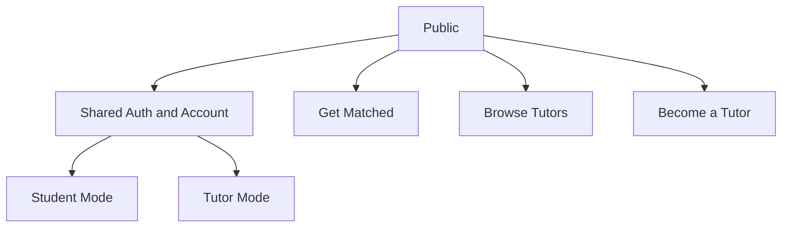

# Mentor IB Information Architecture Map

**Date:** 2026-04-07
**Status:** Foundation document for wireframing
**Companion docs:**
- `docs/foundations/service-blueprint-two-sided.md`
- `docs/foundations/ux-object-model.md`
- `docs/wireframes/low-fi-wireframe-spec.md`

## 1. Purpose

This document defines the recommended information architecture for the fresh-start Mentor IB experience.

It covers:

- public IA
- authenticated shared IA
- student IA
- tutor IA
- navigation principles
- mobile navigation rules

## 2. IA Principles

### Principle 1

The product is match-first, not search-first.

### Principle 2

Student and tutor areas are part of one ecosystem, not two products.

### Principle 3

Shared objects should preserve shared navigation logic where possible.

### Principle 4

Mobile navigation should adapt by role, but still feel like one system.

## 3. Top-Level Modes

## 4. Public IA

### Primary public navigation

- Home
- Get Matched
- Browse Tutors
- Become a Tutor
- How It Works
- Trust and Safety
- Support

### Supporting public pages

- Tutor profile
- Compare
- Subject pages
- FAQ
- Legal
- About

### Notes

- `Get Matched` is the primary CTA
- `Browse Tutors` remains visible but secondary
- `Become a Tutor` should be top-level, not buried in the footer

## 5. Shared Auth and Account IA

These should feel nearly identical across roles.

### Shared auth pages

- Log in
- Sign up
- Role confirmation / lightweight mode selection where needed
- Passwordless / callback states

### Shared account pages

- Account settings
- Notifications
- Billing wrapper where relevant
- Privacy and data controls
- Support

### Shared account navigation logic

- account menu in header
- notification entry point
- settings entry point
- support entry point

## 6. Student IA

## 6.1 Student primary navigation

Recommended desktop primary nav:

- Home
- Get Matched
- Browse Tutors
- Saved / Compare
- Lessons
- Messages

Recommended account-level destinations:

- Reviews to do
- Settings
- Support

## 6.2 Student mode IA map

### Home

Purpose:

- continue where the student left off
- surface next lesson, outstanding actions, and recommended tutors

Key modules:

- current need or active plan
- next lesson
- continue matching
- saved tutors
- pending actions

### Get Matched

Purpose:

- guided intake flow

Key screens:

- match intro
- problem selection
- subject/component
- urgency
- support style
- language/timezone
- results

### Browse Tutors

Purpose:

- open exploration with optional filters

Key screens:

- browse results
- filters
- saved

### Tutor Profile

Purpose:

- evaluate a tutor in depth

### Compare

Purpose:

- compare shortlisted tutors side by side

### Lessons

Purpose:

- manage requests, upcoming, past, cancelled

### Messages

Purpose:

- communicate with tutors in context

## 6.3 Student mobile navigation

Recommended bottom nav:

- Home
- Match
- Lessons
- Messages
- Saved

Rules:

- keep to five items max
- unread states appear on Messages
- if compare is active, it lives inside Saved rather than as a separate tab
- the bar may hide or shrink on downward scroll and return on upward scroll, but it must remain the primary mobile navigation model

## 7. Tutor IA

## 7.1 Tutor primary navigation

Recommended desktop primary nav:

- Overview
- Requests and Lessons
- Students
- Messages
- Schedule
- Earnings
- Public Profile

Secondary destinations:

- Reviews and Outcomes
- Credentials
- Settings

## 7.2 Tutor mode IA map

### Overview

Purpose:

- show the tutor what requires attention now

Key modules:

- next lesson
- pending requests
- unread messages
- availability issues
- profile health
- earnings snapshot

### Requests and Lessons

Purpose:

- one operational hub for request review and lesson lifecycle management

Key screens:

- pending
- upcoming
- past
- cancelled
- lesson detail

### Students

Purpose:

- lightweight teaching CRM

Key screens:

- student roster
- student detail overview
- lessons
- notes/reports
- messages

### Messages

Purpose:

- communicate with students with lesson context attached

### Schedule

Purpose:

- control recurring availability and date-specific exceptions

Key screens:

- weekly schedule
- exceptions / blackout dates
- booking preview

### Earnings

Purpose:

- view payout readiness, transaction history, and performance-linked earnings state

### Public Profile

Purpose:

- edit and preview the outward-facing tutor representation

### Reviews and Outcomes

Purpose:

- review proof and post-lesson teaching continuity

### Credentials

Purpose:

- upload and manage trust proof

## 7.3 Tutor onboarding IA

Tutor onboarding should sit before the main tutor mode, but remain inside the same ecosystem.

Recommended flow:

- Become a Tutor landing
- Eligibility / fit check
- Account creation
- Application
- Review pending
- Admin approved
- Tutor dashboard with payout-setup CTA
- Public listing enabled
- Enter full tutor mode

## 7.4 Tutor mobile navigation

Recommended mobile navigation:

- hamburger or drawer navigation
- overview
- lessons
- messages
- students
- schedule
- earnings
- profile
- credentials
- settings

Rules:

- tutors should be treated as desktop-primary for dense operational work
- mobile tutor access should stay available, but secondary to desktop usage
- do not force a dense bottom nav when the tutor information architecture is broader than the student one

## 8. Shared Object Entry Points

To preserve ecosystem consistency, major objects should be reachable from multiple places.

### Lesson

Entry points:

- student lessons
- tutor overview
- tutor lessons
- messages
- notifications

### Conversation

Entry points:

- messages
- lesson detail
- student detail
- tutor profile / booking confirmation

### Availability

Entry points:

- tutor schedule
- tutor profile preview
- student booking flow
- reschedule flow

### TutorProfile

Entry points:

- match results
- browse
- compare
- public tutor profile
- tutor self-edit mode

## 9. Screen Priority By Release Focus

## Priority 1

- Home
- Match flow
- Results / search
- Tutor profile
- Compare
- Booking flow
- Student lessons
- Messages
- Tutor application
- Tutor overview
- Tutor lessons
- Tutor schedule

## Priority 2

- Tutor students
- Tutor public profile editing
- Tutor earnings
- Tutor credentials
- Reviews and outcomes
- Shared settings

## Priority 3

- deeper report archive
- visibility/performance coaching surfaces
- advanced scheduling rules

## 10. IA Rules For Shared Ecosystem Behavior

### Rule 1

If the same object exists in both roles, preserve the same label where possible.

Examples:

- `Lessons`, not `Sessions` in one place and `Bookings` in another unless there is a strong reason
- `Messages`, not `Inbox` for one role and `Chat` for another

### Rule 2

Role change should alter emphasis, not identity.

### Rule 3

Tutor mode should be operationally denser, but not structurally alien.

### Rule 4

Public and authenticated areas should share the same design DNA.

## 11. IA Decisions — Resolved

These decisions were confirmed during product review on `2026-04-13`:

- `Get Matched` is the default signed-in student first destination. There is no separate logged-in `Home` that competes with it.
- `Saved` and `Compare` are one combined IA node. Compare lives inside the Saved surface, not as a separate destination. This keeps mobile bottom nav to five items (Home, Match, Lessons, Messages, Saved) with compare functionality accessible from the saved list.
- Tutor `Requests and Lessons` is one combined hub, not separate navigation entries.
- `Reviews and Outcomes` remains one combined area. Both are post-lesson tutor content (reviews received and lesson outcomes/reports) and share lesson context. Splitting would add navigational complexity without clear user benefit.

## 12. What This IA Should Drive Next

This IA is the basis for:

- low-fi wireframes
- role-aware navigation components
- screen inventory
- component reuse decisions
