# Mentor IB Cross-Role Service Blueprint

**Date:** 2026-04-07
**Status:** Foundation document for IA and wireframes
**Companion docs:**
- `docs/research/ui-ux-research-fresh-start.md`
- `docs/research/ui-ux-research-two-sided-ecosystem.md`
- `docs/foundations/ux-object-model.md`
- `docs/foundations/ia-map-two-sided.md`

## 1. Purpose

This document maps the end-to-end Mentor IB experience across student and tutor roles.

It is intentionally product- and UX-focused, not technical. The goal is to define:

- the shared lifecycle of the service
- the key handoffs between roles
- the moments where trust is won or lost
- the screens and interactions that must feel like one ecosystem

## 2. Service Principle

Mentor IB is one service with two operating modes:

- Student mode: understand, decide, book, continue
- Tutor mode: respond, prepare, teach, follow up

The service blueprint should therefore be read horizontally, not as two unrelated funnels.

## 3. Core Lanes

### Student lane

- pressure point appears
- needs help fast
- wants clarity and confidence
- wants a good-fit tutor with minimal comparison work

### Tutor lane

- wants qualified, relevant students
- needs efficient operations
- needs a clear view of requests, schedule, and lesson follow-through
- needs the platform to support reliability and credibility

### Shared service lane

- matching logic
- communication and trust framing
- lesson state management
- continuity across lessons and reviews

### Support lanes

- Admin: approval, moderation, and trust governance

The parent or guardian payer flow is intentionally out of current MVP scope.

## 4. Lifecycle Overview

```mermaid
flowchart LR
  A["Need appears"] --> B["Student gets matched"]
  B --> C["Student evaluates options"]
  C --> D["Booking request and payment hold"]
  D --> E["Tutor reviews request"]
  E --> F["Payment captured and lesson confirmed"]
  F --> G["Pre-lesson preparation"]
  G --> H["Lesson takes place"]
  H --> I["Review and report"]
  I --> J["Repeat, reschedule, or close"]
```

## 5. Cross-Role Blueprint

| Stage | Student goal and feeling | Tutor goal and feeling | Shared objects | Primary screens | Key UX risk | Design response |
|---|---|---|---|---|---|---|
| 1. Need recognition | "I need help with this IB problem now." Anxiety, urgency, uncertainty. | Not yet active. | `LearningNeed`, `TutorProfile` | Home, Get Matched intro, subject/problem entry | Generic marketplace framing makes the product forgettable. | Lead with pressure-point language: IA, TOK, EE, IO, exam rescue, weekly support. |
| 2. Guided matching | "Show me likely good fits." Wants relief, not research work. | Wants to be surfaced for the right student needs. | `LearningNeed`, `Match`, `TutorProfile` | Match flow, recommendation results | Asking subject-first instead of problem-first weakens relevance. | Problem-led intake, urgency, style, language, timezone. |
| 3. Browse and shortlist | "I want to compare only a few strong options." | Wants profile and credibility to be understood quickly. | `Match`, `TutorProfile`, `Availability`, `Review` | Search results, compare, saved list | Infinite card grids create choice overload. | Use rich list rows with "Why this tutor fits" reasoning. |
| 4. Tutor evaluation | "Can I trust this tutor and book confidently?" | Wants profile to communicate fit, expertise, and working style. | `TutorProfile`, `Credential`, `Availability`, `Review` | Tutor profile, compare | Biography-first profiles feel like databases. | Start with fit summary, best-for statements, proof, and booking readiness. |
| 5. Booking request | "I want to request time with minimal friction and not chase the tutor later." | Wants clear request context and low ambiguity. | `Lesson`, `Payment`, `Availability`, `Conversation` | Booking flow, schedule surface, request summary | Booking feels disconnected from timezone, scheduling realities, and payment certainty. | Use one lesson object, timezone-aware schedule grammar, and request-time payment authorization that does not require the student to monitor tutor approval manually. |
| 6. Request review | Waiting for confirmation. Needs reassurance that the request and payment hold are still safe. | "Should I accept this request?" Needs context fast. | `Lesson`, `Student`, `Conversation`, `Payment` | Tutor overview, requests list, lesson detail | Tutor side becomes generic back-office admin. | Show student need, urgency, request cutoff, and accept/decline actions in one lesson pattern. |
| 7. Confirmation | Wants certainty, payment clarity, and next steps. | Wants operations and earnings state to update clearly. | `Lesson`, `Notification`, `Conversation`, `Earning` | Confirmation, lessons hub, messages, finance summary | Acceptance and next steps can feel fragmented. | Capture payment on acceptance, then use one consistent confirmed-lesson state across both roles. |
| 8. Pre-lesson prep | "What do I need to do before the lesson?" | "What do I need ready before I teach?" | `Lesson`, `Conversation`, `Report` | Lesson detail, messages, student detail | Important prep falls into chat history or disappears. | Bring lesson context, notes, and pre-lesson cues into the lesson surface. |
| 9. Lesson delivery | Wants smooth join experience and confidence. | Wants a clean operational path into the session. | `Lesson` | Lessons hub, lesson detail, join action | Session feels detached from the platform. | One clear join state, countdown, and follow-up entry point. |
| 10. Post-lesson follow-up | "Was this useful? What next?" | Wants to capture outcomes without admin pain. | `Review`, `Report`, `Lesson` | Review flow, lesson detail, tutor reports | Reviews and reports can feel bolted on. | Make post-lesson continuity part of the core lesson object. |
| 11. Ongoing relationship | Wants continuity, future lessons, and less friction. | Wants repeat teaching, student context, and workload control. | `Student`, `Tutor`, `Lesson`, `Conversation`, `Availability` | Student lessons, saved/compare, tutor students, schedule | Product resets to a cold marketplace for every next step. | Build continuity surfaces: my students, lesson history, suggested next session. |

## 6. Frontstage Experience Requirements

These moments must feel consistent across roles:

- Lesson status language
- Timezone handling
- Conversation context
- Notification style
- Save/compare/book/accept/cancel patterns
- Empty states and reassurance copy

These moments can differ in emphasis, but not in visual grammar:

- Student discovery vs tutor operations
- Public-facing browse vs logged-in management
- Lessons hub vs dashboard overview

## 7. Priority Journey Threads

### Thread A: New student, urgent need

1. Student lands with a concrete pressure point
2. Completes guided intake
3. Receives 3-5 best-fit tutors
4. Compares two or three
5. Sends booking request and payment hold
6. Receives confirmation and next steps after tutor acceptance

### Thread B: Newly approved tutor

1. Tutor is approved
2. Sees readiness checklist and payout-setup gate
3. Completes profile quality, schedule setup, and payout readiness
4. Becomes publicly bookable
5. Receives first relevant booking request
6. Accepts
7. Teaches
8. Completes follow-up and builds momentum

### Thread C: Ongoing tutor-student relationship

1. Existing student returns
2. Rebooks or continues support
3. Tutor sees student context and recent history
4. Lesson happens
5. Progress and next steps accumulate over time

## 8. Design Implications By Stage

### Stage 1 to 3: Match-first, not catalog-first

- Home must route toward a problem-led match flow
- Browse remains available, but secondary
- Search results need fit rationale, not just metadata

### Stage 4 to 7: Shared lesson grammar

- Booking request, acceptance, and confirmation should all use one lesson vocabulary
- Tutor and student should see the same lesson, with different available actions

### Stage 8 to 11: Continuity, not one-off transactions

- Lesson history should be useful, not archival
- Students and tutors should both feel that previous work carries forward
- Reports, notes, and next recommended actions should have a home

## 9. Trust-Critical Moments

These are the highest-risk moments in the service:

- First recommendation list
- First tutor profile impression
- Booking request summary
- Tutor request triage
- Acceptance confirmation
- Pre-lesson reminders
- Post-lesson follow-up

Each of these should be treated as a design priority, not as a supporting screen.

## 10. Ecosystem Rules Derived From The Blueprint

### Rule 1

Every cross-role handoff must preserve context.

Examples:

- the reason a student matched with a tutor
- the lesson request details
- the relevant subject and IB scenario
- the next required action

### Rule 2

The shared objects should drive the UI, not the route structure.

Examples:

- `Lesson` should appear as the same core pattern in request lists, upcoming lists, detail screens, and notifications
- `Conversation` should keep lesson context attached

### Rule 3

The tutor side should feel like "teaching workflow" rather than "operations software."

### Rule 4

The student side should feel like "guided academic support" rather than "marketplace shopping."

## 11. What This Blueprint Unlocks Next

This document should be used to create:

- the canonical UX object model
- the information architecture map
- low-fi wireframes for all priority screens
- the shared component inventory

## 12. Immediate Wireframing Priorities

Based on the blueprint, the first wireframes should cover:

1. Home
2. Match flow
3. Search / results
4. Tutor profile
5. Compare
6. Booking flow
7. Student lessons hub
8. Tutor dashboard overview
9. Tutor students
10. Tutor lessons
11. Tutor schedule
12. Tutor application
