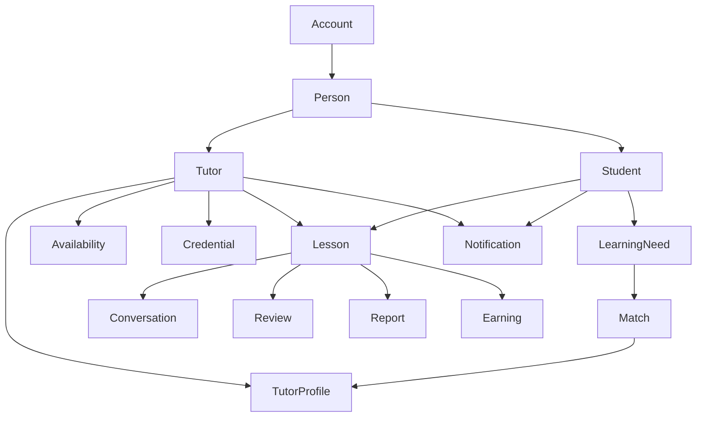

# Mentor IB Canonical UX Object Model

**Date:** 2026-04-07
**Status:** Foundation document for IA, wireframes, and component planning
**Companion docs:**
- `docs/foundations/service-blueprint-two-sided.md`
- `docs/foundations/ia-map-two-sided.md`
- `docs/wireframes/low-fi-wireframe-spec.md`

## 1. Purpose

This document defines the canonical product objects that should drive the Mentor IB UX.

The main rule is simple:

**Design around shared product objects, not around separate role-specific screens.**

If both student and tutor interact with the same object, start from one canonical representation and vary only:

- information priority
- permissions
- available actions
- density

## 2. Object Graph

## 3. Canonical Objects

## 3.1 Account

### Purpose

The account is the identity container for authentication, settings, privacy, and role context.

### UX rule

Do not create separate visual ecosystems for role access. If multi-role access exists later, it should switch modes inside one account, not feel like logging into another product.

### Core states

- unauthenticated
- onboarding
- active
- limited
- suspended

### Shared surfaces

- auth
- account menu
- settings
- notifications preferences
- data export / delete

## 3.2 Person

### Purpose

The human identity layer that underpins tutor and student views.

### Core attributes

- name
- avatar
- timezone
- language
- role context
- communication preferences

### Shared surfaces

- avatar block
- person summary row
- message header
- lesson header

### Design note

The platform should have one canonical `PersonSummary` pattern, adapted by context.

## 3.3 Student

### Purpose

A student is not just a buyer. In the UX, the student should be represented as a learner with a current need, lesson history, and continuity.

### Core attributes

- current need
- active subjects/components
- urgency
- timezone
- current lesson status
- support history

### Shared surfaces

- tutor-side student roster
- lesson detail
- message context header

### Tutor-side emphasis

- current stage
- next lesson
- recent activity
- progress/report visibility

## 3.4 Tutor

### Purpose

A tutor is both a person and an operational actor.

### Core attributes

- expertise
- best-for scenarios
- reliability
- teaching style
- availability
- proof signals

### Shared surfaces

- results list
- tutor profile
- lesson detail
- message header
- compare

### Tutor-side emphasis

- profile quality
- responsiveness
- availability health
- earnings and workload

## 3.5 LearningNeed

### Purpose

This is the object that captures the student's current IB problem.

This is essential because the product is moving from search-first to problem-first.

### Core attributes

- need type
- subject or component
- urgency
- support style
- language
- timezone
- session frequency intent

### Core states

- draft
- active
- matched
- booked
- archived

### Shared surfaces

- match flow
- recommendation context bar
- compare
- tutor request context

### Design note

Every recommendation list should retain visible connection to the `LearningNeed` that generated it.

## 3.6 Match

### Purpose

A match is not just a search result. It is a tutor candidate evaluated against a student's active need.

### Core attributes

- fit rationale
- match score or confidence label
- best-for statement
- availability overlap
- key proof signals

### Core states

- candidate
- shortlisted
- compared
- contacted
- booked
- dismissed

### Shared surfaces

- recommendations list
- search results
- saved tutors
- compare

### Design note

The canonical `MatchCard` or `MatchRow` must always answer:

- why this tutor fits
- what they are best for
- whether they are available soon
- why they are trustworthy

## 3.7 TutorProfile

### Purpose

The public and semi-public explanation of a tutor's fit, credibility, and working style.

### Core attributes

- fit summary
- best-for scenarios
- teaching style
- IB subject/component coverage
- languages
- timezone
- credentials
- ratings and review proof
- schedule readiness
- pricing

### Shared surfaces

- public profile
- compare
- tutor-side profile editor
- profile preview

### Design rule

The tutor profile should be one object with two modes:

- public consumption mode
- owner edit mode

Do not design them as unrelated artifacts.

## 3.8 Availability

### Purpose

Availability is the contract between tutor supply and student booking.

### Core attributes

- weekly recurring hours
- date-specific overrides
- blackout periods
- notice rules
- buffer rules
- daily/weekly capacity rules
- timezone
- external conflict state

### Core states

- open
- constrained
- blocked
- overridden
- hidden

### Shared surfaces

- tutor schedule editor
- booking slot picker
- lesson rescheduling
- availability preview

### Design rule

Use one canonical `ScheduleSurface` grammar:

- student mode: browse/select
- tutor mode: create/edit/control

## 3.9 Lesson

### Purpose

The lesson is the single most important shared object in the ecosystem.

### Core attributes

- student
- tutor
- linked need
- subject/component
- date and time
- timezone context
- status
- meeting method
- payment state
- price / trial state
- message / request context

### Core states

- draft request
- pending
- accepted
- declined
- cancelled
- upcoming
- in progress
- completed
- reviewed

### Shared surfaces

- requests
- upcoming lessons
- past lessons
- lesson detail
- notifications
- dashboard modules

### Design rule

There should be one canonical lesson anatomy across both roles:

- who
- what
- when
- status
- context
- action

The actions vary by role; the underlying object does not.

## 3.10 Conversation

### Purpose

The conversation is the continuity layer between one student and one tutor across matching, booking, preparation, lessons, and follow-up.

### Core attributes

- participants
- active booking or lesson context when relevant
- unread state
- mute state
- last activity
- relevant next action

### Core states

- new
- active
- muted
- blocked
- archived

### Shared surfaces

- chat list
- thread view
- lesson detail entry point
- student detail entry point

### Design rule

One conversation UI should serve both roles, with only role-specific framing and quick actions.

In MVP, use one persistent conversation per student-tutor relationship rather than creating a new thread for every lesson.

## 3.11 Review

### Purpose

The review is the public trust object that validates tutor quality.

### Core attributes

- rating
- comment
- subject/component context
- reviewer identity summary
- lesson recency

### Core states

- pending
- submitted
- published
- flagged

### Shared surfaces

- tutor profile
- tutor reviews page
- lesson completion flow

## 3.12 Report

### Purpose

The report is the continuity object after a lesson.

### Core attributes

- lesson goal
- work covered
- student confidence / performance signal
- next steps
- recommended focus

### Core states

- due
- drafted
- submitted
- shared
- acknowledged

### Shared surfaces

- tutor lesson completion flow
- tutor student detail
- student lesson history

### Design note

Even if reports ship later, leave room in the IA and lesson detail model now.

## 3.13 Earning

### Purpose

The earning object links lesson delivery to payout and reliability.

### Core attributes

- lesson linkage
- gross amount
- fees/commission
- net amount
- payout status
- issue flags

### Core states

- projected
- pending
- available
- paid
- refunded
- adjusted

### Shared surfaces

- tutor earnings dashboard
- lesson detail
- transaction history

## 3.14 Credential

### Purpose

The credential is the trust object that proves tutor legitimacy and expertise.

### Core attributes

- credential type
- file or evidence
- display status
- review status

### Core states

- draft
- uploaded
- pending review
- approved
- rejected
- hidden

### Shared surfaces

- tutor application
- credential management
- profile trust proof

## 3.15 Notification

### Purpose

The notification is the system prompt for action and reassurance.

### Core attributes

- source object
- event type
- urgency
- read state
- CTA

### Core states

- unread
- read
- dismissed

### Shared surfaces

- notification center
- headers / badges
- inbox-like modules on dashboards

## 4. Canonical Composite Patterns

These are the most important reusable composites derived from the object model.

### PersonSummary

Used in:

- messages
- lessons
- students
- tutor results

### MatchRow

Used in:

- match results
- search results
- saved tutors

### LessonCard

Used in:

- student lessons
- tutor lessons
- dashboard requests
- upcoming lesson modules

### ScheduleSurface

Used in:

- booking flow
- reschedule flow
- tutor schedule editor
- profile preview

### ConversationShell

Used in:

- student chat
- tutor chat

### ProfileSection

Used in:

- tutor public profile
- tutor profile editor
- student detail

## 5. Shared State Language

The following state language should remain consistent everywhere:

- Pending
- Accepted
- Declined
- Cancelled
- Upcoming
- Completed
- Reviewed
- Unread
- Muted
- Available
- Blocked

Do not create multiple verbal systems for the same underlying states.

## 6. Reuse Rules

### Rule 1

Start every new screen by asking which canonical object is primary.

### Rule 2

If two roles touch the same object, begin from one shared pattern.

### Rule 3

Only fork a component when the object itself meaningfully changes, not just because the screen is different.

### Rule 4

Role-specific wrappers are preferred over role-specific re-inventions.

Examples:

- `LessonCard` plus student/tutor actions
- `ChatView` plus role-specific empty state copy
- `ScheduleSurface` plus edit/select mode

## 7. What This Object Model Should Drive Next

This model should directly inform:

- route and IA decisions
- component inventory
- wireframe structures
- state and badge systems
- profile and dashboard logic

## 8. Immediate Priority Objects

The first design passes should center on these five:

1. `LearningNeed`
2. `Match`
3. `TutorProfile`
4. `Lesson`
5. `Availability`

These five define the whole strategic shift from marketplace to matching ecosystem.
